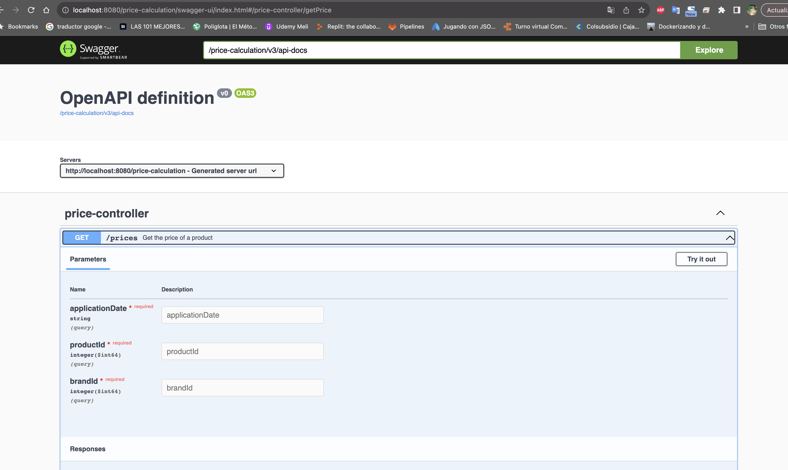
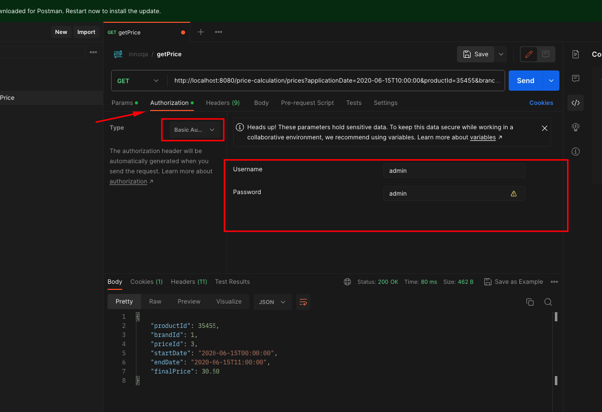
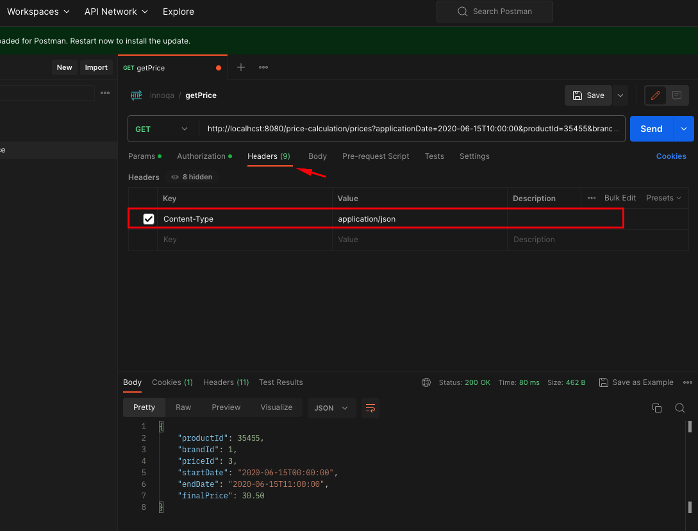
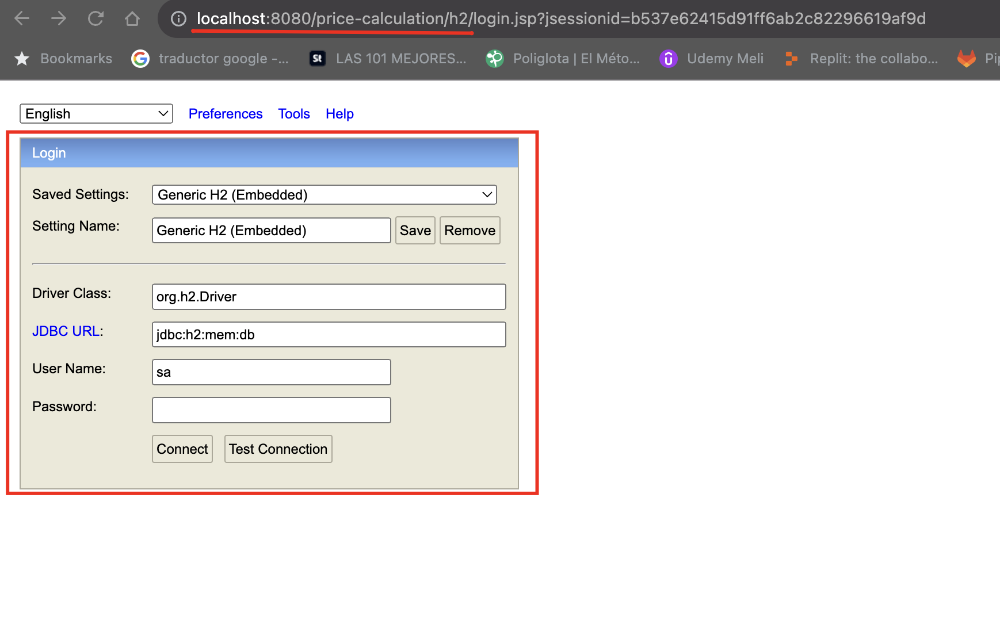

## Price Calculation

This project get the Price calculation engine for E-commerce.

### Features.

- `url local`: http://localhost:8080/price-calculation
- `DB`: H2, base de datos volátil.
- `Url DB local`: http://localhost:8080/price-calculation/h2/
- `Context`: price-calculation
- `Code building tool`: Gradle
- `Framework`: Spring boot 3.1.2
- `Language`: Java 17
- `Architecture design`: Hexagonal architecture.

### Available methods.

- `Get price - GET`: http://localhost:8080/price-calculation/prices?applicationDate=2020-06-15T10:00:00&productId=35455&brandId=1

Response success: Http-Code: 200

```json
{
  "productId": 35455,
  "brandId": 1,
  "priceId": 3,
  "startDate": "2020-06-15T00:00:00",
  "endDate": "2020-06-15T11:00:00",
  "finalPrice": 30.50
}
```

### All endpoints:

Price:

- `GET`: http://localhost:8080/price-calculation/prices?applicationDate=2020-06-15T10:00:00&productId=35455&brandId=1

## ¿How to run the program?

LOCAL STEPS:

- Clone the project from the following path using the ' git clone: https://github.com/angiekroll/pricecalculation.git '
- Import the project from your IDE in this case intellij
- Compile the project
- Run
- Tester Potsman or from url Swagger: http://localhost:8080/price-calculation/swagger-ui.html

  

- The application has basic security, so when sending the request the postman must be configured
  with "Basic Auth"

```
Username: admin
Password admin
``` 

- In the header there must be the key Content-Type: application/json

  
  


### DOCKER:

STEPS WITH DOCKER:

1. Clone the project from the following path using the ' git clone: https://github.com/angiekroll/pricecalculation.git '
2. Import the project to your IDE, in this case intelliJ IDEA.
3. Compile the project.
4. Docker must be installed on the local machine.
5. Open a terminal and go to the root of the project PriceCalculation.
6. Build the Docker image using the following command:
    ```
    docker build -t price-calculation . 
    ```
7. Run the docker container using the following command:
   ```
   docker run -d -p 8080:8080 price-calculation
    ```
8. The Postman collection is attached to all endpoints in the mail so it can be downloaded and used
   to make the corresponding requests. Also you can use the following url
   Swagger: http://localhost:8080/price-calculation/swagger-ui.html Or the following curl:
   ```
    curl --location 'http://localhost:8080/price-calculation/prices?applicationDate=2020-06-15T10%3A00%3A00&productId=35455&brandId=1' \
    --header 'Content-Type: application/json' \
    --header 'Authorization: Basic YWRtaW46YWRtaW4=' \
    --header 'Cookie: JSESSIONID=D638DAB160E023113067F6977CB494D4'
   ```
9. To access the H2 DB, once the application is deployed, you
   must go to the following route:
    - http://localhost:8080/price-calculation/h2/

## ¿How to connect to the DB?

- `JDBC`: jdbc:h2:mem:db
- `User Name`: sa
- `Password`:



